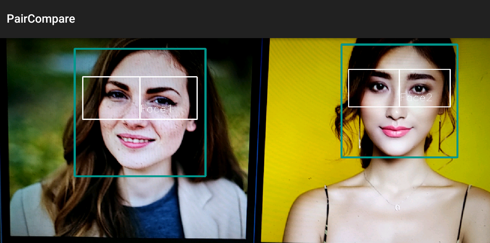
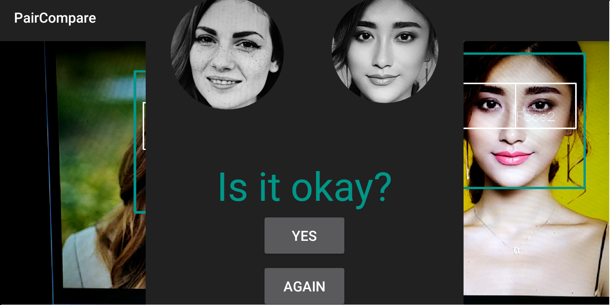
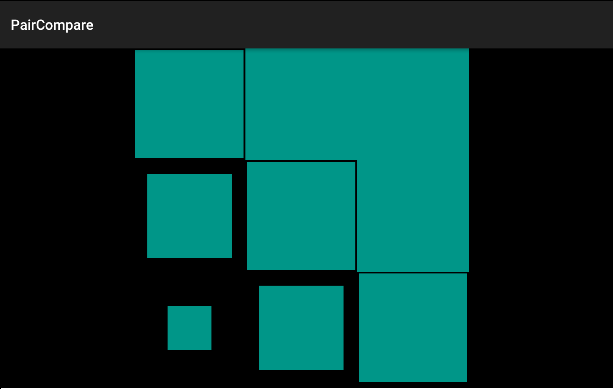
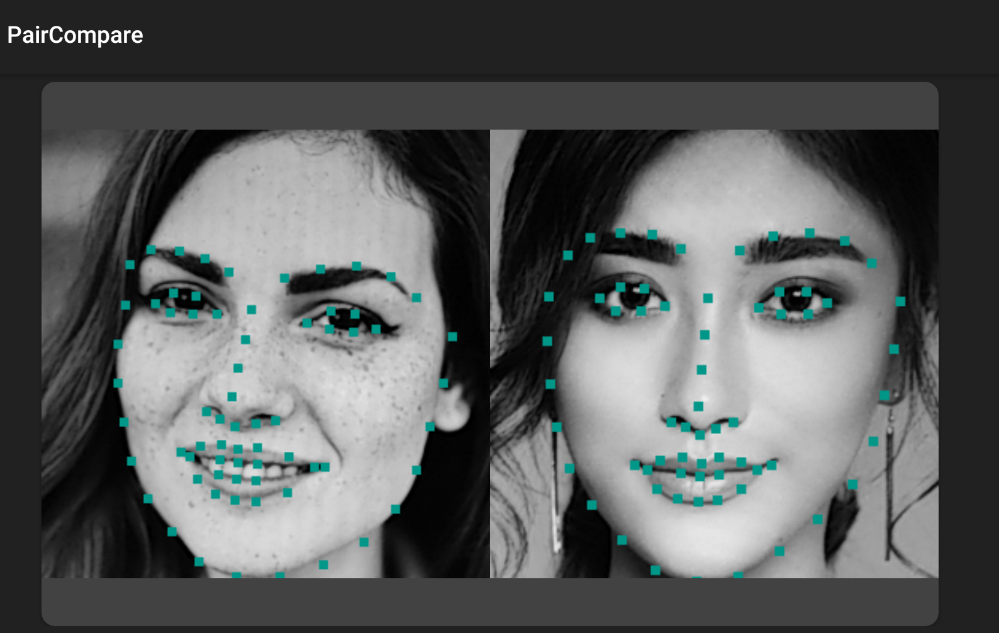
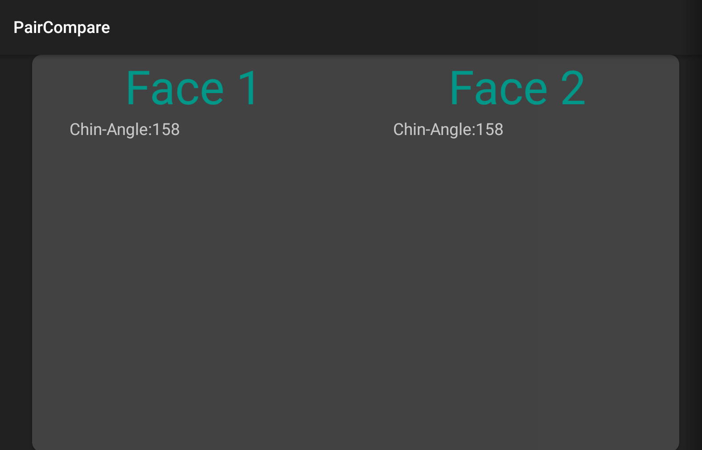

# PairCompare - Android - OpenCV - dlib
A research project in computer vision.

Pictures taken from Pexels. [License](https://www.pexels.com/photo-license/) 

[Face Left](https://www.pexels.com/photo/woman-wearing-coat-762020/)
[Face Right](https://www.pexels.com/photo/adult-attractive-beautiful-beauty-415829/)

